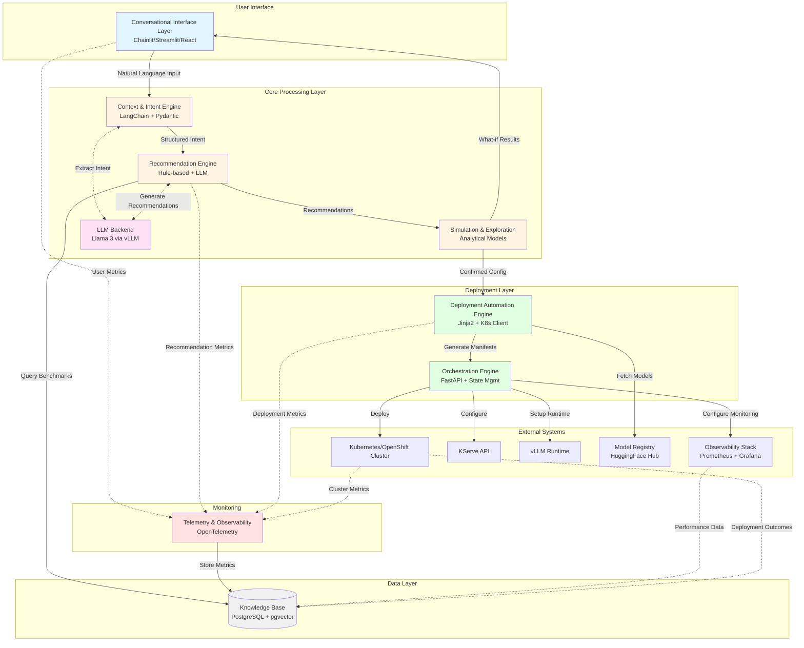
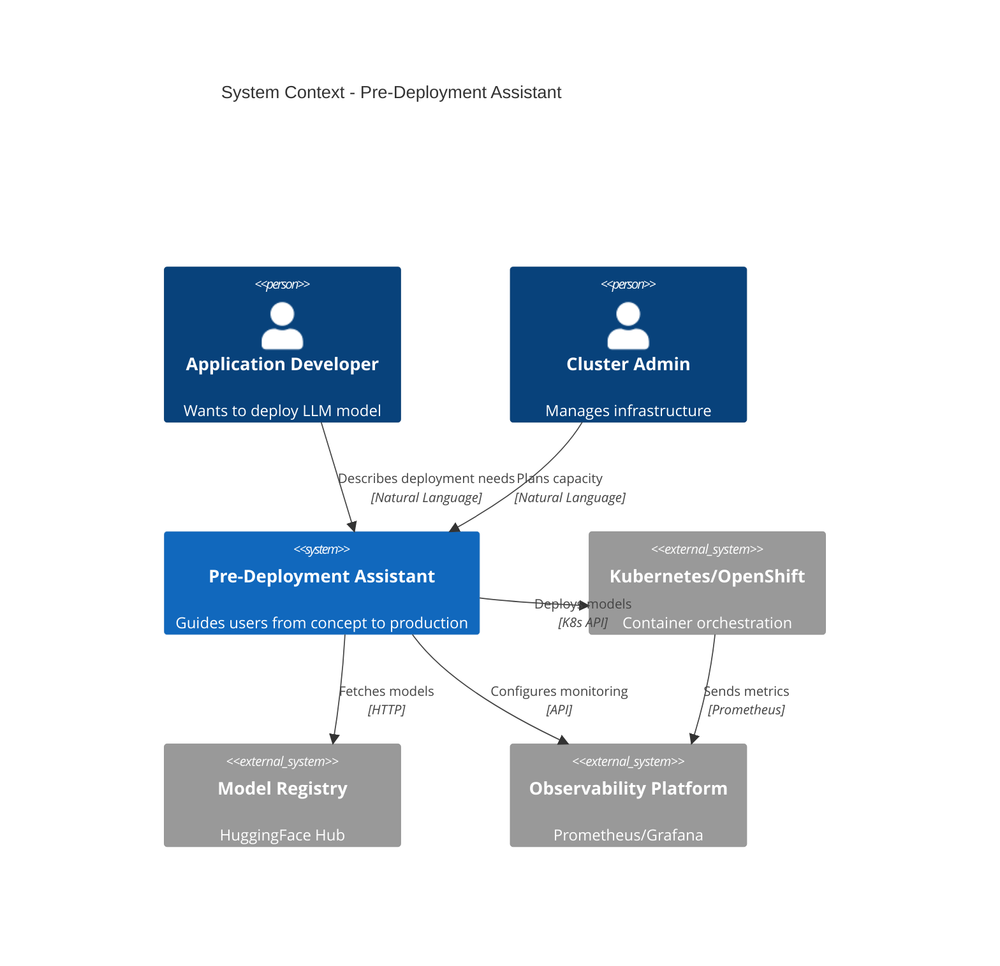
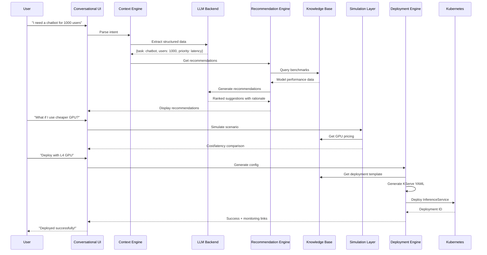
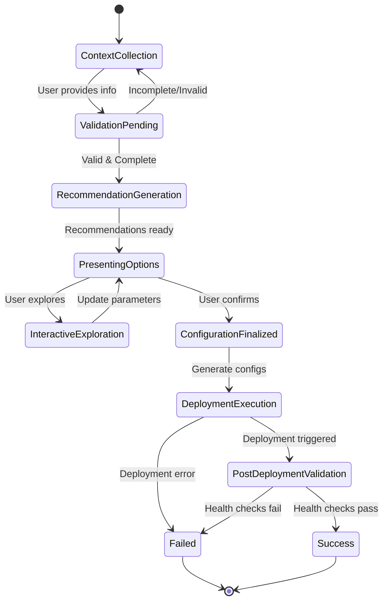
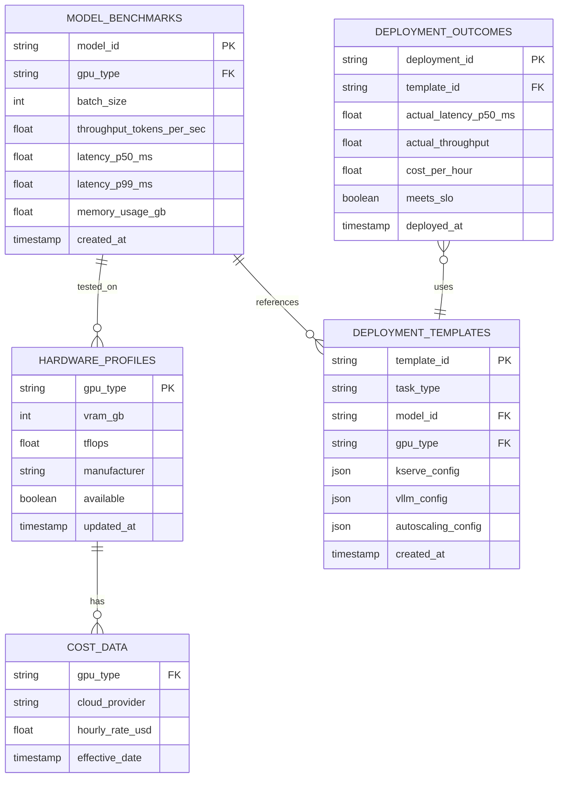

# Pre-Deployment Assistant Architecture Diagram

## Component Flow Description

### 1. User Interaction Flow
1. User interacts via **Conversational Interface** (Chainlit/Streamlit)
2. **Context & Intent Engine** extracts structured requirements using LLM
3. **Recommendation Engine** generates model/hardware/SLO suggestions
4. User explores options via **Simulation Layer**
5. User confirms configuration

### 2. Deployment Flow
1. **Deployment Automation Engine** generates KServe/vLLM configs
2. **Orchestration Engine** coordinates deployment steps
3. Manifests deployed to **Kubernetes/OpenShift**
4. **KServe** provisions model serving endpoint
5. **vLLM** runtime configured for inference
6. **Observability** hooks configured automatically

### 3. Data Flow
- **Knowledge Base** stores benchmarks, hardware profiles, templates
- **LLM Backend** powers conversational AI and recommendations
- **Telemetry** captures user interactions, deployment outcomes, system metrics
- **Feedback Loop** enriches Knowledge Base with real deployment data

### 4. Integration Points
- **Model Registry** (HuggingFace Hub) for model artifacts
- **Kubernetes API** for cluster operations
- **KServe API** for model serving
- **Prometheus/Grafana** for monitoring and alerting

---

## Detailed Architecture Diagram

---

## Component Interaction Sequence

---

## State Machine - Workflow Orchestration

---

## Data Model - Knowledge Base Schema

---

## Technology Stack Summary

| Layer | Component | Technology |
|-------|-----------|------------|
| **Presentation** | UI Framework | Chainlit |
| **Application** | Intent Extraction | LangChain + Pydantic |
| **Application** | Recommendations | Rule-based + LLM |
| **Application** | Simulation | Analytical formulas |
| **Application** | Orchestration | FastAPI |
| **AI/ML** | LLM Backend | Llama 3 via vLLM |
| **Data** | Knowledge Base | PostgreSQL + pgvector |
| **Deployment** | Config Generation | Jinja2 |
| **Deployment** | K8s Integration | Kubernetes Python Client |
| **Observability** | Metrics | OpenTelemetry + Prometheus |
| **Observability** | Dashboards | Grafana |
| **Infrastructure** | Container Platform | OpenShift/Kubernetes |
| **Infrastructure** | Model Serving | KServe + vLLM |
