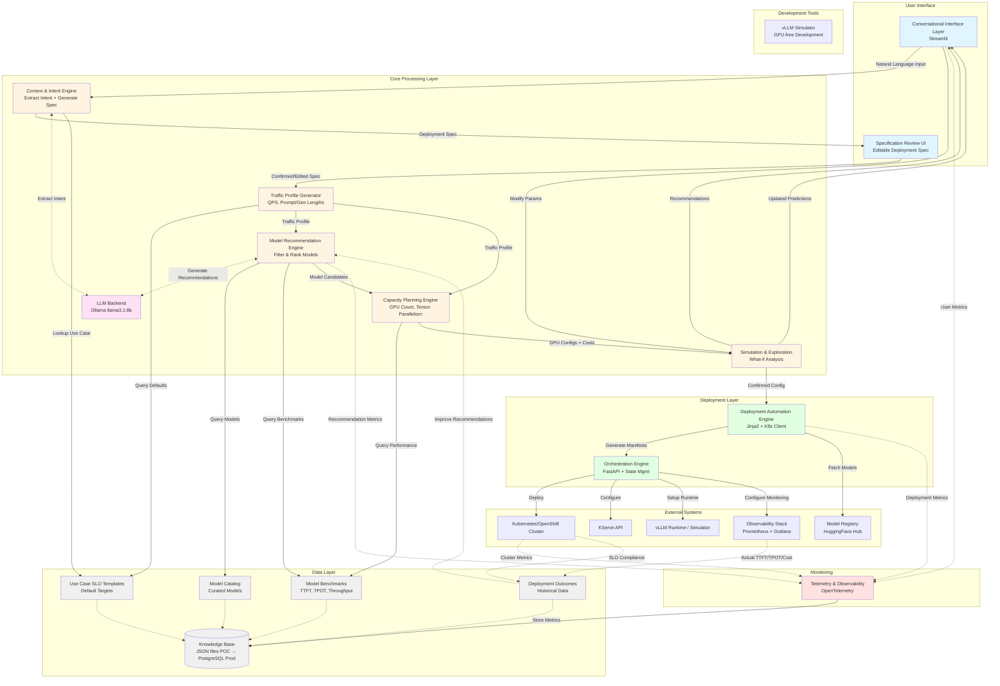
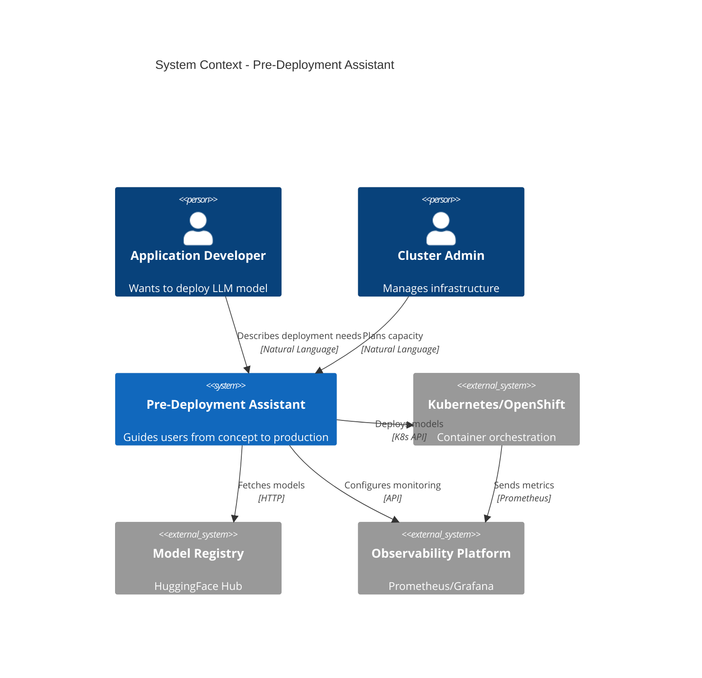
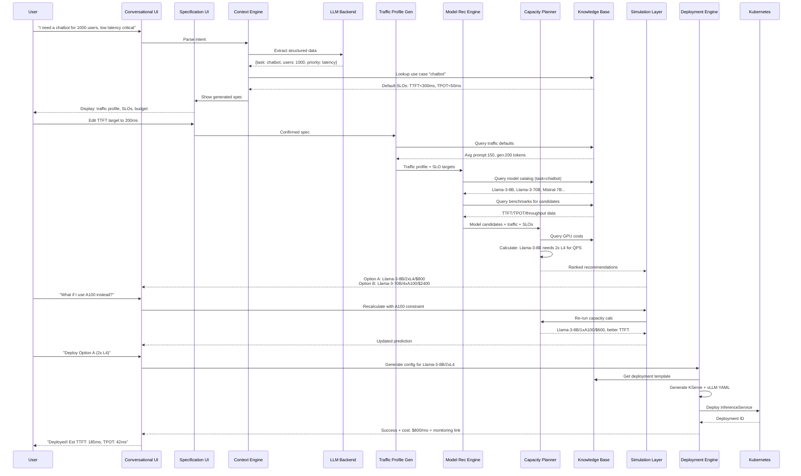
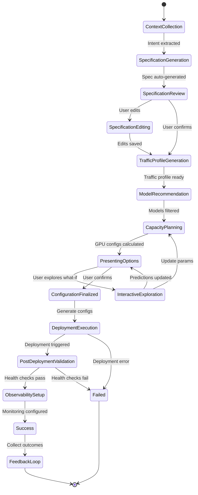
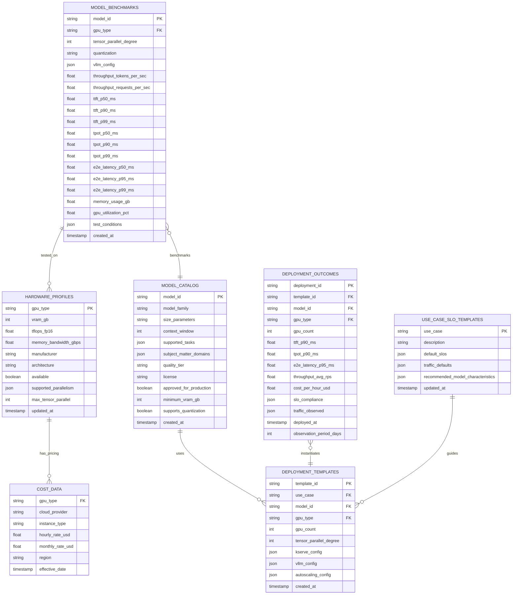

# Pre-Deployment Assistant Architecture Diagram

## Component Flow Description

### 1. User Interaction & Specification Generation
1. User interacts via **Conversational Interface** describing their use case
2. **Context & Intent Engine** extracts structured intent using LLM
3. Engine looks up **Use Case SLO Templates** for default targets
4. System generates complete **Deployment Specification** (traffic profile, SLOs, constraints)
5. **Specification Review UI** displays editable spec to user
6. User optionally modifies traffic params, SLO targets, or constraints

### 2. Recommendation Flow
1. **Traffic Profile Generator** converts high-level requirements → QPS, prompt/gen lengths
2. **Model Recommendation Engine** queries **Model Catalog** and filters by task compatibility
3. Engine queries **Model Benchmarks** for performance data
4. **Capacity Planning Engine** calculates GPU count and configuration for each model
5. System ranks recommendations by user priority (cost vs latency vs accuracy)
6. **Simulation Layer** presents ranked options with cost/latency/SLO predictions

### 3. What-If Exploration
1. User modifies model selection, GPU type, or SLO targets in **Simulation Layer**
2. System re-calculates capacity requirements and cost predictions
3. User compares scenarios side-by-side
4. User selects final configuration

### 4. Deployment Flow
1. **Deployment Automation Engine** generates KServe/vLLM configs from selected option
2. **Orchestration Engine** coordinates deployment steps
3. Manifests deployed to **Kubernetes/OpenShift**
4. **KServe** provisions model serving endpoint
5. **vLLM** runtime configured for inference
6. **Observability** hooks configured automatically

### 5. Feedback Loop
- **Observability Stack** captures actual TTFT, TPOT, throughput, cost
- **Deployment Outcomes** stored in Knowledge Base
- System learns from discrepancies between predicted vs actual performance
- Future recommendations improve based on historical data

### 6. Data Flow
- **Use Case SLO Templates** → Default targets for chatbot, summarization, etc.
- **Model Catalog** → Curated, approved models with metadata
- **Model Benchmarks** → TTFT/TPOT/throughput for model+GPU combinations
- **Deployment Outcomes** → Historical data for continuous learning
- **LLM Backend** powers conversational AI and recommendation explanations

### 7. Integration Points
- **Model Registry** (HuggingFace Hub) for model artifacts
- **Kubernetes API** for cluster operations
- **KServe API** for model serving
- **Prometheus/Grafana** for monitoring and alerting

---

## Detailed Architecture Diagram

---

## Component Interaction Sequence

---

## State Machine - Workflow Orchestration

---

## Data Model - Knowledge Base Schema

---

## Technology Stack Summary

| Layer | Component | Technology |
|-------|-----------|------------|
| **Presentation** | UI Framework | Streamlit (POC) |
| **Application** | Intent Extraction | Ollama (llama3.1:8b) + Pydantic |
| **Application** | Recommendations | Rule-based + LLM |
| **Application** | Simulation | Analytical formulas |
| **Application** | Orchestration | FastAPI |
| **AI/ML** | LLM Backend | Ollama (llama3.1:8b) |
| **Data** | Knowledge Base | JSON files (POC) → PostgreSQL (Prod) |
| **Deployment** | Config Generation | Jinja2 |
| **Deployment** | K8s Integration | Kubernetes Python Client |
| **Deployment** | vLLM Simulator | FastAPI + Docker |
| **Observability** | Metrics | Kubernetes API |
| **Observability** | Dashboards | Streamlit |
| **Infrastructure** | Container Platform | Kubernetes (KIND for POC) |
| **Infrastructure** | Model Serving | KServe + vLLM / Simulator |
