# Compass Architecture Diagram

## High-Level Architecture

```mermaid
graph TB
    subgraph "UI Layer - Horizontal Presentation"
        UI[Conversational Interface<br/>Streamlit]
        SPEC_UI[Specification Editor<br/>Review & Edit]
        VIZ[Recommendation Visualizer<br/>Trade-offs & Comparisons]
        DASH[Monitoring Dashboard<br/>Status & Testing]
    end

    subgraph "API Gateway"
        API[FastAPI Endpoints<br/>Workflow Orchestration]
    end

    subgraph "Core Engines - Backend Services"
        ISE[Intent & Specification Engine<br/>LLM + Traffic Profile Generation]
        REC[Recommendation Engine<br/>Model Selection + Capacity Planning]
        DEP[Deployment Engine<br/>YAML Generation + K8s Deployment]
        OBS[Observability Engine<br/>Monitoring + Testing]
    end

    subgraph "Knowledge Base - Data Layer"
        KB_PG[(PostgreSQL<br/>Benchmarks + Outcomes)]
        KB_JSON[JSON Files<br/>SLO Templates + Model Catalog]
    end

    subgraph "External Systems"
        K8S[Kubernetes Cluster<br/>KServe + vLLM]
        REGISTRY[Model Registry<br/>HuggingFace Hub]
    end

    %% UI to API Gateway
    UI -->|User Input| API
    SPEC_UI -->|Edited Spec| API
    VIZ -->|Selected Config| API

    %% API Gateway to Engines
    API -->|Extract Intent| ISE
    API -->|Get Recommendations| REC
    API -->|Deploy Config| DEP
    API -->|Get Status| OBS

    %% Engine to Knowledge Base
    ISE -->|Lookup SLO Templates| KB_JSON
    ISE -->|Query Historical Traffic| KB_PG
    REC -->|Query Benchmarks| KB_PG
    REC -->|Query Model Catalog| KB_JSON

    %% Engine to Engine
    ISE -->|Deployment Spec| REC
    REC -->|Selected Recommendation| DEP
    DEP -->|Deployment Metadata| OBS

    %% Engines to External Systems
    DEP -->|Deploy| K8S
    DEP -->|Fetch Models| REGISTRY
    OBS -.->|Monitor| K8S

    %% Future: Feedback Loop
    OBS -.->|Store Metrics<br/>(Phase 3+)| KB_PG
    KB_PG -.->|Learn from History<br/>(Phase 3+)| ISE

    %% API Gateway to UI
    API -->|Display Spec| SPEC_UI
    API -->|Display Recommendations| VIZ
    API -->|Display Status| DASH

    style UI fill:#e1f5ff
    style SPEC_UI fill:#e1f5ff
    style VIZ fill:#e1f5ff
    style DASH fill:#e1f5ff
    style API fill:#ffe1f5
    style ISE fill:#fff4e1
    style REC fill:#fff4e1
    style DEP fill:#e1ffe1
    style OBS fill:#ffe1e1
    style KB_PG fill:#f0f0f0
    style KB_JSON fill:#f0f0f0
```

## Component Flow Description

### 1. User Interaction & Specification Generation
1. User interacts via **Conversational Interface** (Streamlit UI) describing their use case
2. **Intent & Specification Engine** extracts structured intent using LLM (Ollama llama3.1:8b)
3. Engine maps use case to **traffic profile** from one of 4 GuideLLM standards: (512→256), (1024→1024), (4096→512), (10240→1536)
4. Engine looks up **Use Case SLO Templates** (JSON) for default p95 latency targets
5. System generates complete **DeploymentIntent specification** (traffic profile, SLO targets, constraints)
6. **Specification Editor** (UI) displays editable spec to user
7. User optionally modifies traffic params, SLO targets, or constraints

### 2. Recommendation Flow
1. **Recommendation Engine** receives complete specification with traffic profile already determined
2. **Model Recommender** queries **Model Catalog** (JSON, 40 models) and filters by task compatibility
3. Engine queries **PostgreSQL Benchmarks** for performance data matching exact traffic profile
4. **Capacity Planner** calculates GPU count and configuration for each model based on SLO compliance
5. System ranks recommendations by user priority (cost vs latency vs accuracy)
6. **Recommendation Visualizer** (UI) presents ranked options with cost/latency/SLO predictions

### 3. Interactive Exploration (UI-driven)
1. User modifies specifications (traffic params, SLO targets) in the **Specification Editor**
2. User triggers re-generation of recommendations with updated parameters
3. **Intent & Specification Engine** updates specification
4. **Recommendation Engine** re-calculates capacity requirements and cost predictions
5. User reviews updated recommendations via **Recommendation Visualizer**
6. User selects final configuration

### 4. Deployment Flow
1. **Deployment Engine** receives selected recommendation
2. Engine generates KServe InferenceService + vLLM configs from Jinja2 templates
3. Engine validates configuration (resource limits, security settings)
4. **API Gateway** coordinates deployment via Kubernetes Python client
5. Manifests deployed to **Kubernetes** cluster (KIND for local dev, production cluster for real deployments)
6. **KServe** provisions model serving endpoint
7. **vLLM Simulator** or real vLLM runtime configured for inference
8. **Observability Engine** configured for basic monitoring

### 5. Monitoring & Observability
**Current (Phase 2)**:
- **Kubernetes API** provides deployment status (pods, services, health)
- **Monitoring Dashboard** (Streamlit UI) displays cluster status and deployment information
- **Inference testing** UI allows sending test prompts to deployed models
- **No feedback loop**: Actual performance metrics are NOT stored back to PostgreSQL

**Future (Phase 3+)**:
- **Prometheus + Grafana** for advanced metrics collection and dashboards
- **vLLM metrics endpoint** for detailed inference statistics (TTFT, ITL, throughput)
- **Feedback loop**: Store actual performance → PostgreSQL → refine future recommendations
- **OpenTelemetry** for distributed tracing

### 6. Data Layer Architecture
**PostgreSQL Storage**:
- **Model Benchmarks** → p95 metrics (TTFT, ITL, E2E) for (model, GPU, traffic profile) combinations
- **Deployment Outcomes** (future) → Actual performance data for continuous learning

**JSON File Storage**:
- **Use Case SLO Templates** → 9 use cases with traffic profiles and experience classes
- **Model Catalog** → 40 curated, approved models with task metadata
- **Hardware Profiles** → GPU specifications and pricing

**Query Patterns**:
- **Exact Traffic Matching** → Benchmarks require exact (prompt_tokens, output_tokens) match
- **SLO Filtering** → Reject configurations where p95 latencies exceed targets

### 7. Integration Points
- **Model Registry** (HuggingFace Hub) for model artifacts
- **Kubernetes API** for cluster operations and monitoring
- **KServe** for model serving orchestration
- **vLLM Simulator** for GPU-free local development
- **PostgreSQL** for benchmark data storage and retrieval

---

## Detailed Architecture Diagram


---

## Component Interaction Sequence

```mermaid
sequenceDiagram
    participant User
    participant UI as Conversational UI
    participant API as API Gateway
    participant ISE as Intent & Spec Engine
    participant LLM as LLM Backend
    participant REC as Recommendation Engine
    participant KB_JSON as JSON Files
    participant KB_PG as PostgreSQL
    participant DEP as Deployment Engine
    participant K8S as Kubernetes

    User->>UI: "I need a chatbot for 1000 users, low latency critical"
    UI->>API: Extract intent
    API->>ISE: Parse user input
    ISE->>LLM: Extract structured data
    LLM-->>ISE: {task: chatbot, users: 1000, priority: latency}

    ISE->>KB_JSON: Lookup use case "chatbot_conversational"
    KB_JSON-->>ISE: SLOs: TTFT p95<150ms, ITL p95<25ms<br/>Traffic: 512→256 tokens

    ISE->>ISE: Generate DeploymentIntent specification<br/>(includes traffic profile + SLO targets)
    ISE-->>API: Complete specification
    API-->>UI: Display specification

    UI-->>User: Show: traffic profile (512→256), SLOs, budget
    User->>UI: Confirm specs (or edit and re-trigger)
    UI->>API: Get recommendations
    API->>REC: Generate recommendations (spec with traffic profile)

    REC->>KB_JSON: Query model catalog (task=chatbot)
    KB_JSON-->>REC: Llama-3.1-8B, Llama-3.1-70B, Mistral-7B...
    REC->>KB_PG: Query benchmarks (model, GPU, 512→256)
    KB_PG-->>REC: p95 metrics: TTFT, ITL, E2E for each config

    REC->>REC: Filter by SLO compliance (p95 targets)<br/>Calculate GPU count and cost<br/>Rank by user priority

    REC-->>API: Ranked recommendations
    API-->>UI: Display recommendations

    UI-->>User: Option A: Llama-3.1-8B/2xL4/$800<br/>TTFT p95: 45ms, ITL p95: 13ms, E2E p95: 3.3s

    User->>UI: "Deploy Option A (2x L4)"
    UI->>API: Deploy selected config
    API->>DEP: Generate deployment artifacts
    DEP->>DEP: Generate KServe + vLLM YAML (simulator mode)
    DEP->>K8S: Deploy InferenceService
    K8S-->>DEP: Deployment ID + status
    DEP-->>API: Success + monitoring endpoint
    API-->>UI: Deployment complete
    UI-->>User: "Deployed! Monitor via Monitoring tab"

    Note over User,K8S: Phase 2: No feedback loop to PostgreSQL<br/>Phase 3+: Observability Engine stores actual metrics
```



---

## State Machine - Workflow Orchestration


---

## Data Model - Knowledge Base Schema (PostgreSQL Phase 2)


---

## Technology Stack Summary (Phase 2)

| Layer | Component | Technology |
|-------|-----------|------------|
| **Presentation** | UI Framework | Streamlit |
| **Application** | Intent Extraction | Ollama (llama3.1:8b) + Pydantic |
| **Application** | Recommendations | Rule-based + LLM + SLO filtering |
| **Application** | Orchestration | FastAPI |
| **AI/ML** | LLM Backend | Ollama (llama3.1:8b) |
| **Data** | Knowledge Base | **PostgreSQL** (psycopg2) |
| **Data** | Benchmark Data | 4 GuideLLM traffic profiles, p95 metrics |
| **Data** | SLO Templates | 9 use cases with experience classes |
| **Deployment** | Config Generation | Jinja2 templates |
| **Deployment** | K8s Integration | Kubernetes Python Client |
| **Deployment** | vLLM Simulator | FastAPI + Docker (GPU-free) |
| **Observability** | Metrics | Kubernetes API |
| **Observability** | Dashboards | Streamlit (basic status) |
| **Infrastructure** | Container Platform | Kubernetes (KIND for local dev) |
| **Infrastructure** | Model Serving | KServe + vLLM Simulator |

---

## Phase 2 vs Phase 3+ Differences

| Feature | Phase 2 (Current) | Phase 3+ (Future) |
|---------|------------------|-------------------|
| **Data Store** | PostgreSQL with exact traffic matching | PostgreSQL + pgvector for similarity |
| **Traffic Profiles** | 4 GuideLLM fixed profiles | Parametric models, interpolation |
| **SLO Metrics** | p95 percentiles (TTFT, ITL, E2E) | p50, p95, p99 tracking |
| **Observability** | Basic status (K8s API + Streamlit) | Prometheus + Grafana + vLLM metrics |
| **Feedback Loop** | **None** - no data stored back | Actual metrics → PostgreSQL |
| **Learning** | Static benchmark data | Continuous learning from outcomes |
| **Monitoring** | Deployment status + inference testing | Advanced SLO compliance tracking |
