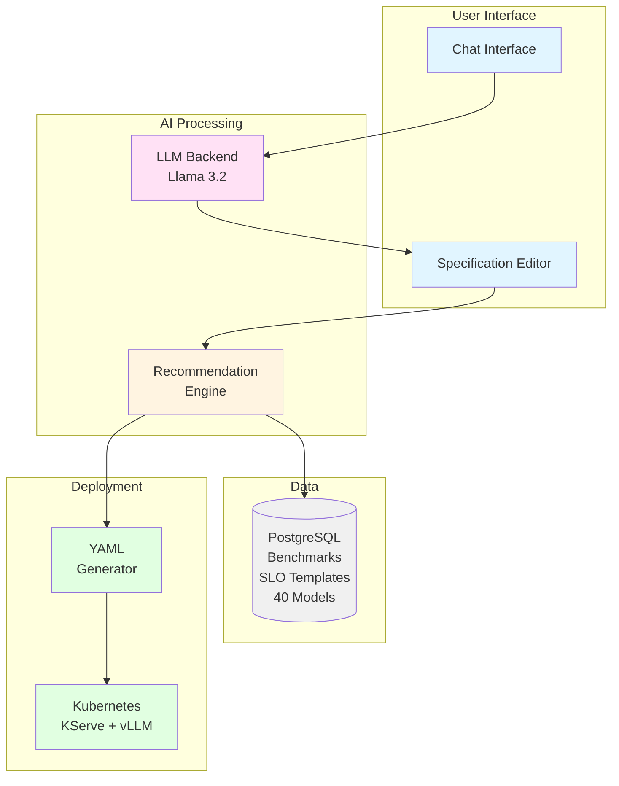

# Simplified Architecture Diagram for Slides

## Option 1: High-Level Flow (Recommended for slides)

```mermaid
---
config:
  layout: fixed
  look: neo
---
flowchart LR
    A["💬 Chat UI"] --> B["🧠 AI Intent<br>Extraction"]
    B --> C["📊 Recommendation<br>Engine"]
    B -.-> LLM["Ollama<br>llama3.1:8b"]
    C --> D["✏️ Review &amp;<br>Edit Specs"]
    D --> E["🚀 Deploy to<br>Kubernetes"]
    E --> F["📈 Monitor<br>&amp; Test"]
    E -.-> K8S["☸️ Kubernetes Cluster<br><small>KIND + KServe + vLLM Simulator</small>"]
    C -.-> KB[("Knowledge Base<br>PostgreSQL<br>Benchmarks, SLOs,<br>40 Models")]
    F -.-> K8S
    style A fill:#e1f5ff
    style B fill:#fff4e1
    style C fill:#fff4e1
    style LLM fill:#E1BEE7
    style D fill:#e1f5ff
    style E fill:#e1ffe1
    style F fill:#ffe1e1
    style K8S fill:#BBDEFB
    style KB fill:#f0f0f0
```

## Option 2: Component View

## Option 3: End-to-End Flow with Labels

```mermaid
flowchart LR
    A["👤 User<br/><i>Describe needs</i>"]
    B["💬 Chat<br/><i>Natural language</i>"]
    C["🧠 AI<br/><i>Extract intent</i>"]
    D["🎯 Recommend<br/><i>Model + GPU</i>"]
    E["✏️ Edit<br/><i>Review specs</i>"]
    F["📄 YAML<br/><i>Generate configs</i>"]
    G["☸️ Deploy<br/><i>Kubernetes</i>"]
    H["✅ Test<br/><i>Inference</i>"]

    A --> B --> C --> D --> E --> F --> G --> H

    KB[("📚 PostgreSQL<br/>Benchmarks<br/>9 Use Cases<br/>40 Models")]
    D <-.-> KB

    style A fill:#fff
    style B fill:#e1f5ff
    style C fill:#fff4e1
    style D fill:#fff4e1
    style E fill:#e1f5ff
    style F fill:#e1ffe1
    style G fill:#e1ffe1
    style H fill:#ffe1e1
    style KB fill:#f0f0f0
```

## Option 4: Vertical Stack (Best for portrait slides)

```mermaid
graph TB
    User["👤 User Input<br/>Natural language requirements"]

    subgraph "Compass"
        Chat["💬 Conversational Interface"]
        Intent["🧠 Intent & Specification Engine"]
        Rec["🎯 Recommendation Engine<br/><small>Model Selection | Capacity Planning</small>"]
        KB[("📚 PostgreSQL<br/><small>Benchmarks p95/ITL | 9 Use Case SLOs | 40 Models</small>")]
        Deploy["🚀 Deployment Automation<br/><small>YAML Generation | K8s Deployment</small>"]
    end

    K8S["☸️ Kubernetes Cluster<br/><small>KServe + vLLM Simulator</small>"]

    User --> Chat
    Chat --> Intent
    Intent --> Rec
    Rec <--> KB
    Rec --> Deploy
    Deploy --> K8S

    style User fill:#fff
    style Chat fill:#e1f5ff
    style Intent fill:#fff4e1
    style Rec fill:#fff4e1
    style KB fill:#f0f0f0
    style Deploy fill:#e1ffe1
    style K8S fill:#e1ffe1
```

## Usage Instructions

1. **Copy the diagram you prefer** from above
2. **Go to https://mermaid.live**
3. **Paste the Mermaid code**
4. **Click "Actions" → "PNG" or "SVG"** to download
5. **Insert into Google Slides**

**Recommendations:**
- **Option 1** (High-Level Flow) - Best for executive summary
- **Option 3** (End-to-End Flow) - Best for showing complete user journey
- **Option 4** (Vertical Stack) - Best if you need portrait orientation

All diagrams are simplified to fit on a single slide while preserving the core concepts.
